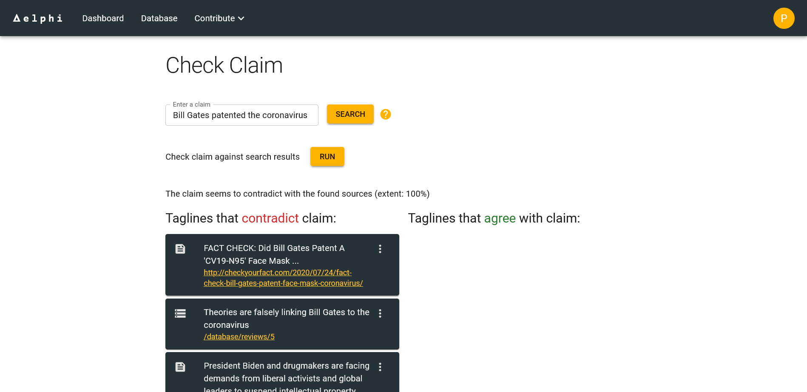

## Delphy – Your fact check assistant tool

> Search for results to any given claim and check the claim against found results.

> Contribute to a claim and review database and grow a fact check resources.

## About

This is my final project from the UpLeveled Bootcamp class of spring 2022. It is an interactive web app that you can try out with the link in the description. Please make sure you read the disclaimer and do not spam search or evaluation requests.

## Getting Started

- Clone the repository with `git clone <repo>`
- Setup the database by downloading and installing PostgreSQL
- Create a user and a database
- Create a new file `.env`
- Copy the database environment variables from `.env-example` into `.env`
- Replace the placeholders xxxxx with your username, password and name of database
- Install dotenv-cli with `yarn add dotenv-cli`
- Run `yarn install` in your command line
- Run the migrations with `yarn migrate up`

Refer to `.env.example` for an overview of the other needed environmental variables (see also "External API dependencies" below)

## How to use the app

Please see the "About" page of the deployed project: https://delphy-fct.herokuapp.com/about

## roBERTa model integration

Make sure to check out the dedicated repository under: https://github.com/Olbertism/RoBERTa-torch-hub

The roBERTa model is accessed like a normal external REST API. In essence, two pieces of text are transmitted to the model, which are then compared to each other checked for contradiction or agreement. You can find the code for the requests in ...

To a successful request, roBERTa will respond with an array of numbers from 0 to 2, which correlate to contradiction, neutral or entailment.

## External API dependencies

Delphy fetches results from the following external APIs:

- Google Factcheck Tool
- Wikipedia
- News API
- The Guardian
- New York Times
- DuckDuckGo (Currently not in use)

You will need to provide valid API keys for some of these services.

If any of these providers change the shape of their respones, Delphy might not be able to process the data from it. In this case, the search results of the given source will just be empty.

For each external API exists a Jest test, that fetches a response and runs the most important checks for compatibility.

## Limitations of the deployed version

Please note that all external APIs are accessed in free plans and thus are subject to request limitations. As a rule of thumb, 100 search requests per day will work, then the first sources will stop to respond. Again, please do not spam requests.

The current deployed endpoint of the roBERTa model will also change in the upcoming months, due to free plan restrictions.

I reserve myself the right to change or wipe the database at any given time.

User registration and authentication do not ask for email addresses. I do not want to store them for this project. If you lose your password, you will not be able to restore it.

## Known issues

- The sort function of the database table is currently not working
- Success alert in "add review" dialog on claim page does not show if first attempt produces an error

## Sources and credits

roBERTa model: https://github.com/facebookresearch/fairseq/blob/main/examples/roberta/README.md

"Polygons" background .svg created with: https://bgjar.com/

Thanks to fakenewschallenge.com for giving me the idea to use "stance" detection approach: http://www.fakenewschallenge.org/

## Further reading

Paper on RoBERTa: https://arxiv.org/abs/1907.11692
